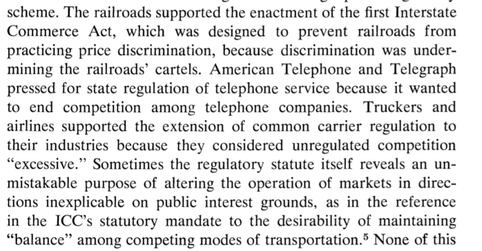

```{r setup, include=FALSE}
knitr::opts_chunk$set(echo = FALSE)
```

# A focus on Three Papers

+ Posner, Richard A. “Theories of Economic Regulation.” The Bell Journal of Economics and Management Science, vol. 5, no. 2, 1974, pp. 335–358. JSTOR, https://www-jstor-org.proxy.lib.pdx.edu/stable/3003113.
+ Stigler, George J. “The Theory of Economic Regulation.” The Bell Journal of Economics and Management Science, vol. 2, no. 1, 1971, pp. 3–21 (https://www-jstor-org.proxy.lib.pdx.edu/stable/3003160)
+ Peltzman, Sam. "Toward a more general theory of regulation." The Journal of Law and Economics 19.2 (1976): 211-240. https://www.jstor.org/stable/725163
        

# Overview

+ Posner(1974)
    + Verbal description of the institutions that references Stigler (1971)
    + Good for the non-technical audience
+ Stigler (1971)
    + Simple empirics on why NTPT does not work
+ Peltzman (1976)
    + Stigler/Peltzman -- they joined forces
    + Gives regulators preferences
    
# Posner

+ Writing this after the Stigler Model came out in 71.  It is a companion to the empirical paper you have.
+ Very focused on the institutions
+ Quirky.
+ Implicitly models
    + Goods production and markets
    + Political production and markets
    + Regulatory production and markets
+ Competing and/or colluding in all three to achieve objectives.

# Nail in the PTNT Coffin

> "...[regulation] is not positively correlate with the presence of external economies or diseconomies or with monopolistic market structure."

And that is mostly true...

# Implicit Model (in Words)

+ Profits are higher when firms in an industry that colludes.
    + Some industry characteristics make it hard to collude in goods market. (Large number of firms)
    + But easy to collude in the regulatory market.
+ If collusion is hard, the industry requests regulation from legislatures.
+ Legislatures start the regulation and then delegate the authority
+ Courts are an alternative to regulation.

# The Public Purpose Hypothesis is then modified

 Regulatory agencies are started with the public in mind, but they are mismanaged or corrupted.

# Killing Strawman Part 1
 



# Killing Strawman Part 2

+ Legislation is frequently sub-optimal or contradictory.
    + Favorite example, full employment and low inflation.
+ The legislative budget process can be thought of as a market
    + There is some discipline
    
# It is the fault of the legislature

Posner says

+ Legislatures have decreasing economies of scale.
+ The bigger they are, the harder to get things done.

Jamie says

+ Clearly, Posner is unclear on the committee system.  