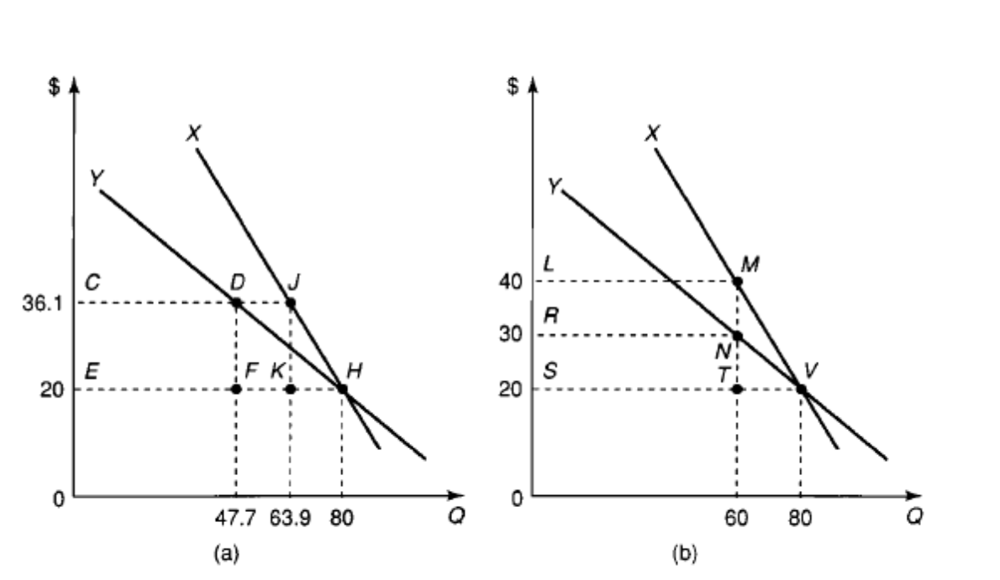
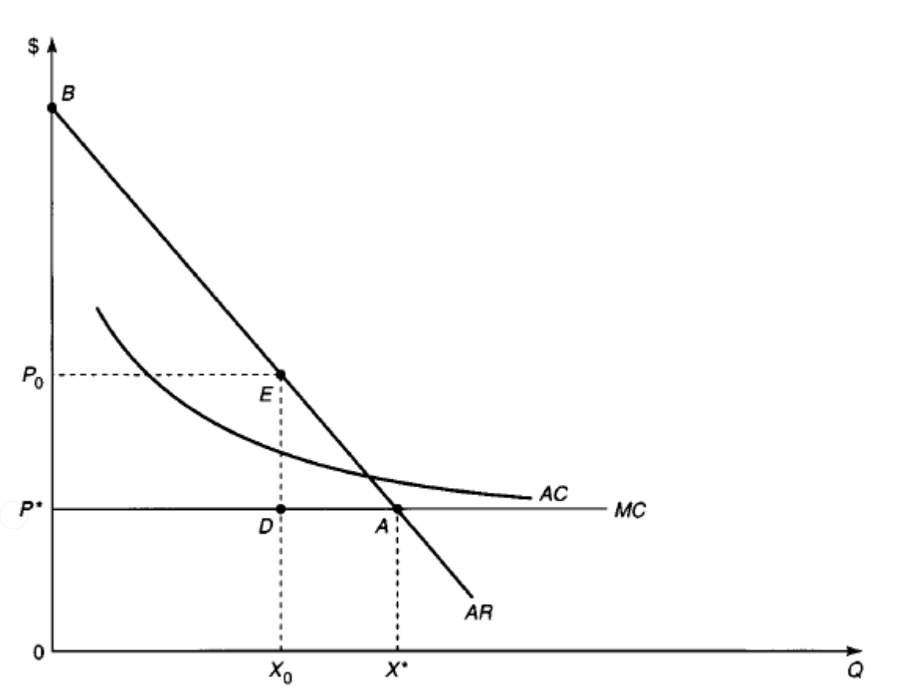

```{r setup, include=FALSE}
knitr::opts_chunk$set(echo = FALSE)
```


## Now that We are Better With Costs

+ Show a natural monopoly in action and how it can harm society.
    + This is about welfare.
    + Efficient production and pricing produces negative profits.
+ How a natural monopoly can transform to perfect competition with sufficient scale.    
+ How with small scale that markets could flip flop from monopoly to competition.
     
+ Some highly theoretical solutions  
    + Two-part tariff
    + Ramsey Pricing
    + Loeb-Magat
    + Franchise Bidding
    
## More Realistic Solutions

+ Regulation of some kind: Cost of service, incentive,  Yardstick competition, etc.
    + These include elements of the "Highly theoretical solutions".
+ Public Ownership


## Why Realistic?

+ Regulation is subject to adverse selection (asymmetric information) and moral hazard (Can change behavior after the fact).
    + Mostly about effort to reduce costs.
+ Realized cost, outputs, some quality measures, and price are verifiable but costs are hard to disentangle.
+ The firm can exit.
+ The regulator may be self-interested or may try to maximize social welfare.


## Natural Monopoly

We Will Show with assumption of one price:

+ Having a natural monopoly does not guarantee positive profits and production.
+ They produce less than the socially optimal output.
+ The socially optimal output produces negative profits.
+ They reduce consumer surplus and induce deadweight loss

## CS/PS Sidebar

+ Key welfare measure in economics
    + Engineer made it up
    + Marshall popularized it.
    + Periodically engineers rediscover, but disappointed that it is >100 years old.
    
+ CS: Difference between what you are willing to pay and what you did pay, for all purchases.
+ PS: Difference between what you sold it for and what you were willing to sell, for all sales.

## Natural Monopoly

We Will Show with assumption of one price:

+ Introduce the idea of minimum efficient scale (MIS)
+ Show how with low demand, we can best be served by one firm.
+ High demand, multiples of MIS can be competitive and have competition induced low costs.

## Costs with Sub and Super additivities

We Will Show with assumption of one price:

+ Sometimes one firm and sometimes more can produce at lowest cost.
+ Sometimes the low cost solution produces the highest price
+ Sometimes the high cost solution produces the lowest price.


## A Two-Part Tariff Fix

We Will Show Graphically under the assumption of full information and no adverse selection:

+ You can provide a lump-sum subsidy to the firm in exchange for marginal cost pricing and achieve efficient production.
+ You can achieve a similar result with a two part tariff, $A + pq$
    + A compensates for fixed cost
    + p compensates for marginal cost
+ Heterogeneity makes this hard. Example industrial and residential consumers but leads to the Ramsey Pricing idea.
    + Ramsey is not two-part but does deal with heterogeneity.

## For Those Interested in the Math

+ Gross Surplus: $S(q, \theta)$
+ Customer type: $\theta \in [\underline{\theta}, \overline{\theta}]$
+ Objective for the just participating type, $\theta$: $S(q(p, \theta*), \theta*) - A - pq(p, \theta*) = 0$
+ Simplifying assumption that uses price as an addition to constant MC.
+ Not shown: constraint to collect enough revenue to cover fixed cost.

$$\max_{A,p} \int_{\theta*(A,p)}^{\overline{\theta}} \left[S(q(p, \theta), \theta) - A - pq(p, \theta)\right]dg(\theta) d \theta$$

## Ramsey Pricing

The problem:

+ You need to collect total taxes, or revenue in our case, of a certain known amount.
+ Several types of agents, with different demands and sensitivity to price changes.
+ Figure out how to collect the revenue/tax so that the deadweight loss is minimized.

## Ramsey

[Ramsey, Frank P. "A Contribution to the Theory of Taxation." The Economic Journal 37.145 (1927): 47-61.](https://www.jstor.org/stable/pdf/2222721.pdf?casa_token=jliFs5YKu8IAAAAA:9u2jMjiG5jeNY6YZVfaMTY4Ejzayg0ZrxjuzxJWzvVOmtrQqaTFq1NNzUesOvC8TRNU4RzpCN3qVh-kCl2iSTaZY0tXxzSUfxxlKZ2nTfupTHF-_HEno)

+ Solved here specifically and more generally for even dealing with a variety of social welfare functions.
+ It is one of the most elegant papers in economics.

## Figure 11.10 in the Book

Has a few simplifying assumptions.

+ Linear demands
+ Two types of agents Y and X.
+ Same quantity demanded at the joint MC of  20.
+ **Regulator/Tax authority knows MC and demands.** 
+ Left is a equal increase in price.
+ Right is equal decrease in quantity demanded.
+ Just assume they did the P and Q math right.

Question:  What is the deadweight loss in both cases?  Is the revenue collected really the same?


## Example from Book



## What Do you Think? 

Whole different idea on fair being about Q and not P.

## Loeb-Magat

What if you don't know costs but you know demand can you still get the firm to produce the effiecient output?

+ Yes, give them a subsidy equal to consumer surplus.
+ Collect the tax from other revenue sources.
+ Aligns profit maximizing interest with welfare (in this market only) interest.
+ Batshit crazy?

## Explaination of Diagram

+ Without the subsidy, MR and AR are different and firm profit maximizes where MR (Not shown) equals MC.  Price is high.
+ With the subsidy, AR is also MR.  The firm profit maximizes where $MR=AR=MC$, i.e., efficiently.
+ Same result as 1st degree price discrimination, i.e., personalized prices.


## Lobe-Magat




## Problems for Our Practical Solution Regulation


## Franchise Bidding.

## Next Up
