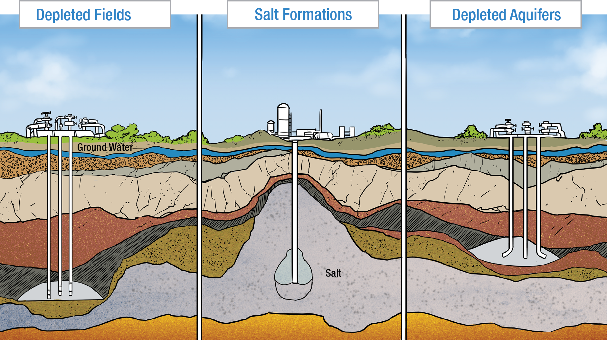
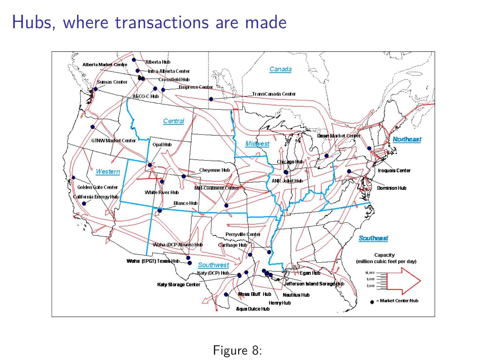
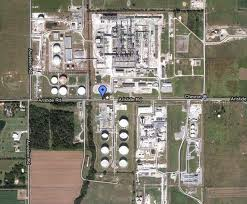
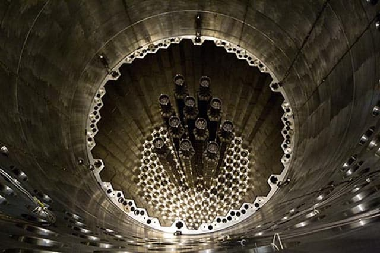
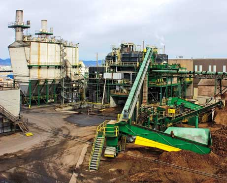
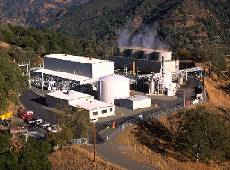
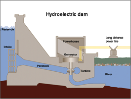
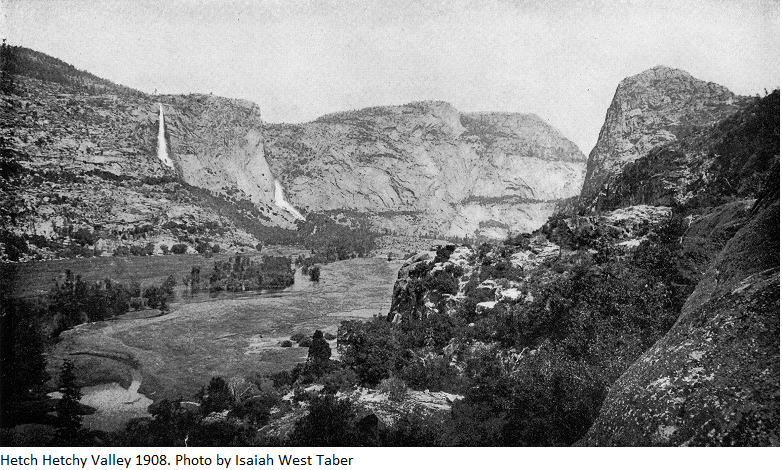

```{r setup, include=FALSE}
knitr::opts_chunk$set(echo = FALSE)
```

## Objectives

+ Need some idea of how we get natural gas and electricity
+ Need to know some of the ways we regulate those two at both state and federal level


## Where is it produced? Just conventional


## More in the shale areas.


## How do you move it within the US? Pipelines (Interstate only).


## What about those pipelines?
+ There are more intrastate pipelines than shown, plenty in TX and CA but also other states
+ Read more here https://www.eia.gov/pub/oil_gas/natural_gas/analysis_publications/ngpipeline/transcorr.html
    + Picture pipes ranging from a foot to three+ feet for trunk lines.
    + Compressor stations every 50-100 miles, ~1,500 total
    + 200 psi to 1,500 depending
+ They are privately owned https://www.eia.gov/pub/oil_gas/natural_gas/analysis_publications/ngpipeline/MajorInterstatesTable.html
    + Open access, posted prices, is a thing.
    + For intrastate, within, state PUC regulate
    + For interstate, FERC regulates (You can find current Tariffs at http://etariff.ferc.gov/TariffList.aspx)

## Compressors


## Compressor Station


## Storage is important


## Most Storage is just old gas wells





## Storage is very seasonal

There is a weekly report on storage by EIA http://www.eia.gov/dnav/ng/hist/nw2_epg0_swo_r48_bcfw.htm

+ Note the seasonality
+ Note the factor of 2+ changes over the term


## Hubs, where transactions are made


## Part of Henry Hub LA



## Getting to Prices
+ You will see wellhead prices, but
+ Most references prices are at the hubs.
    + Henry Hub in LA is the most common reference hub for prices
    + There are fairly firm relationships between other hubs and HH except when there is congestion.
    + Changes in the usual difference are usually called basis blowout. Term is not specific to energy.

+ Intercontinental Exchange for Gas Itself
    + https://www.theice.com/products/OTC/Physical-Energy/Natural-Gas
+ FERC for transportation tariffs (Regulated)
    + http://etariff.ferc.gov/TariffList.aspx
    + Some are fixed and some have a market rate component.

It is hard to talk about gas separate from transportation.


## What Makes Electricity Interesting

+ We somehow start with a fuel (Counting wind, geothermal and sunlight in this).
+ Transport it from where we found it to a generating facility.
+ Turn it into electricity losing some energy as heat.
+ Run it along long wires to where people want to use it, losing yet more energy.
+ From there send it out to every small location (losing more), and
+ Because electricity is not _easily_ stored, adjust the rate at which we generate electricity moment-by-moment to make sure there is just enough.

This is a logistical miracle.

## Basic Units

+  $Watts = Amps Volts$ first thing everyone learns.
    + Pro tip on units, if it is someones name, capitalize it.
    + Volt is analogous to height.
    + Amp is analogous to a weight.
    + Watt is what it happens when that weight is dropped from that height.
    
## kW vs kWh

+ kW is instantaneous and called power
+ kWh is the integral over time and called energy.

+ 100 W light bulb uses 100 Wh = 1/10 kWh per hour

+ Get used to flipping between 1,000,000,000 W =  1,000,000 kW = 1,000 MW = 1 GW

## Lets Generate Some Electricity

+ Turbine -- spin something in a magnetic field to induce a current.
+ Lots of ways to spin a turbine
    + Coal, grind it up, burn it, make steam, use steam to spin the turbine.
    + Nuclear, use the heat to make steam, use steam to spin a turbine.
    + Biomass, burn stuff to ...
    + Gas, burn it to spin a turbine ...
    + Fuel Oil or Diesel
    + Solar thermal, use the sun to make steam ...
    + Water, falling water hits a turbine and spins it
    + Wind, spin a turbine
    + etc.

+ Or don't spin a turbine and go for photo-voltaic, PV.

## Characteristics

+ Nameplate, fully loaded under ideal conditions (MW)
+ Ramp rate, how fast power (MW) can change MW/min
    + Not always constant, can differ by capacity factor (fraction of nameplate)
    + Not always symmetric, up different from down.
    + Used to follow the load.
+ Heat rate, BTU in/ BTU out, only used for generation that uses a fuel.
    + 1 is impossible but 1 kW = 3412 BTU.
    + Recent average from EIA, https://www.eia.gov/electricity/annual/html/epa_08_01.html

## Characteristics

+ Nameplate, fully loaded under ideal conditions (MW)
+ Ramp rate, how fast power (MW) can change MW/min
    + Not always constant, can differ by capacity factor (fraction of nameplate)
    + Not always symmetric, up different from down.
    + Used to follow the load.
+ Heat rate, BTU in/ BTU out, only used for generation that uses a fuel.
    + 1 is impossible but 1 kW = 3412 BTU.
    + Recent average from EIA, https://www.eia.gov/electricity/annual/html/epa_08_01.html

## Coal from the outside


Source: http://appvoices.org/images/uploads/2012/02/Asheville-coal-plant-e1432059203783.jpg

## Coal on the inside

+ Pulverize the coal, picture something that can do 20 Tons/hr
+ Blow it into combustion chamber to burn
+ Steam turns turbine, etc. https://youtu.be/IdPTuwKEfmA

+ Clean up
    + NOx with ammonia common but plenty of others
    + Recover fly ash and sell it, great for concrete.
    + SOx, Mercury and other.  BTW Radiation

## Nuclear

Radiation to heat water and then ...similar to coal.  Just a reaction chamber



## Local Reactor Columbia Generating Station


+ 1,170 MW usually runs as load following.  It reacts fast enough.
    + France is ~70% nuclear and they load follow.
+ Most nuclear is run as base load, i.e., all the time since low variable cost and high fixed cost.
+ Palo Verde (AZ) is larger 3.3GW

## So, about nuclear

+ So what to do with spent fuel.
+ They probably produce less radiation than coal
+ Can produce cheap, in the marginal cost sense, power.  More on this later.

## Natural Gas Conventional and Combined Cycle

+ Combined cycle means
    + Taking more than one pass at extracting energy.
    + Spin the turbines first.
    + Take the heat and run a steam turbine.
    + Take the remaining heat and use a different working fluid (with different phase change properties) to extract more.

+ CCNG
    + Plants are more expensive
    + Have lower heat rates, which means more efficient.
+ Conventional
    + Cheap
    + Commonly run as peaking units.

## Biomass

+ Tend to be combined heat and power. Another way of using waste heat.
    + Cogeneration like this is common.
    + We have steam and chill water systems on campus
+ While renewable, it is not, in general, clean
    + Particulates
    + Heavy metal concentration
    + etc.
+ All this is improving.

## Biomas One in Eugene. 30 MW and keeps catching on fire.




source: http://www.woodbioenergymagazine.com/magazine/2009/summer/article-biomass-one.html

## Geothermal

+ Drill a hole down to where the temperature is high enough.
    + If it is dry, add water to make steam.
    + If wet, get steam
    + If temp is not high enough, use a few working fluids to generate electricity.

+ Run through a turbine.

## Neal Hot Spring in Malheur. 30 MW



## Diesel and other Fuel Oils

+ You know the drill ...
+ Less than 1\% in the US for electricity generation.
    + Still common heating fuel.
    + Backup fuel for NG generation
    + May be used in small distributed generation
+ More common in less developed countries

## Solar Thermal

+ You have seen the low and mid temperature designs for heating and cooling.
+ High temperature designs are:
    + Dish
    + Tower
    + Trough

+ Fluids:
    + Oil
    + Salt
    + Water steam

+ Low and mid temperature are similar to roof top residential that you have seen.

## Hydro

So, you spin a turbine




## Hydro can be complex

+ Many constraints
    + Intra and interseason storage requirements
    + Temperature and turbidity constraints
    + Treaties and contracts
    + Minimum and maximum flow constraints
    + Dredging
    + Water quality


+ Can you go all hydro?
    + US ~6\%
    + Norway ~95\%

## Everything Comes with a cost



## Wind

+ You find a good wind resource NREL Class 3 and up (http://www.nrel.gov/gis/wind_detail.html)
+ Put up a suitably rated 2.5–3 MW windmill (Larger over time). 8MW is the largest I've hear about.
+ Maintain them, upgrade them and if need be demo them.

+ What people complain about
    + Noise -- Can't hear after a mile or two
    + Raptor and bat kills -- Less now with larger slower moving designs.
    + Ugly -- In in the eye of the beholder.

## PV

+ Does not spin a turbine.
+ PV effect generates DC electricity which is then converted to AC though an inverter

## Levelized Cost of Electricity (LCOE) and Levelized Cost of Avoided Electricity (LACE)

+ https://www.eia.gov/outlooks/aeo/pdf/electricity_generation.pdf Table 1
    + CC is Carbon Capture.
    + CCS is Carbon Capture and Storage
    

## The Players

+ Investor Owned Utilities (IOUs)
    + BIG
    + Holding companies with multiple subsidiaries.
    + Sister companies with common parent.
+ Public
    + Muni -- City owned
    + PUD -- Own district with boards
    + Co-ops -- Private non-profit (rural)

## Types of Players

+ Vertically integrated -- G + T (>115kV) + D (<35kV)
    + They own some of each but buy some too.
    + Often D is all them.
+ Distribution Only -- D
    + Don't own T or D but buy on the market.
    + Look at restructured states for this.
    + SDG&E recently said they were interested.
+ Note that T is open access, like a toll road with posted prices.    
    
## Multiple Jurisdictions for Siting

These overlap:

+ EPA, BLM and others have some say.
+ FERC handles most Federal
    + If Hydro or Nuke sighting the FERC
+ If other type off generation then local PUC.

## General Pattern

If you can make it work with a well designed market -- do it.

If you can't -- cost of service regulation.

Modern trend to incentive regulation.

## Federal Power is  Odd

+ BPA is classic
    + The army corp of engineers runs the dams.
    + BPA (Power Marketing Agency) sells the power.
+ Generally
    + Sell to local D or G/T/D company
    + Have other G + T resources
    
## G Only

+ Often called merchant power
+ or IPP
+ or non-utility generator

## Public Owned

Tend to be D only but:

+ Our local PUDs do own generation.
+ Most power is from contract purchase
+ BPA is often the supplier for the co-ops.

## Do Customers Have Choice?

A: Sometimes

+ Large customers
    + Billed for D by local utility
    + Purchase G on contract
    + Pay for T bundled with G or by OASIS posted prices.
    
+ Residential and Others
    + In fully deregulated yes
    + Often the old local was default, exception Texas
    + Often marketing costs exceed profit so not done.

+ Community Choice, big groups choosing G, is the next big wave.

## Transmission

+ The interconnects  are in sync but not with each other.
+ Still exchange power by DC connects.
+ FERC covers rates and service standards for this.
    + Access via OATT/OASIS.  OASIS is  implementation of part of OATT.
    + OATT has a lot in it.  Prices are only part.
    
## Managing Transmission

+ FERC delegated a lot of reliability to  North American Electric Reliability Council (NERC).
+ ISO/RTO voluntary but characteristics created by FERC
    + Plan, operate, dispatch and provide OASIS.
    + Notice OWN is not on the list.
    + Control area for their region
+ Others operate control areas outside ISO/RTO territory
    + BPA
    + Our local IOUs
+ ISO/RTO run markets
    + Ancillary services
    + Power Markets

## Expanding ISO/RTO

+ CAISO has plans for expanding
    + PGE and Pacific Power are tentatively on board
+ Energy Imbalance Markets
    + Power market outside bounds of ISO
    
## The Locals

+ OPUC is governor appointed
+ COUs and Co-ops are by vote
    + Sometimes per person (COU)
    + Sometimes per meter (Co-ops)
    + Rules for Co-ops vary.
    
## What they Do

+ Revenue requirement
+ Allocate costs
+ Design prices
+ Quality Standards
+ Check IOU finances
+ Be a judge in disputes.

Consumer advocate is sometimes in or separate agency and sometimes separate.  Oregon CUB is separate.
    

## How Did We Get to the Current G-T-D Arrangement (MES Argument)

+ Both large scale and small scale originally existed.
+ Large scale developed
    + Lower AC
    + Higher MES
    + Speed of change up till 60s made this the dominant form.
+ Small scale continued to develop
    + Right sized scale and MES
    + Decreasing AC
    + 1978 Qualifying Facilities Era was when they could sell power under some conditions.

