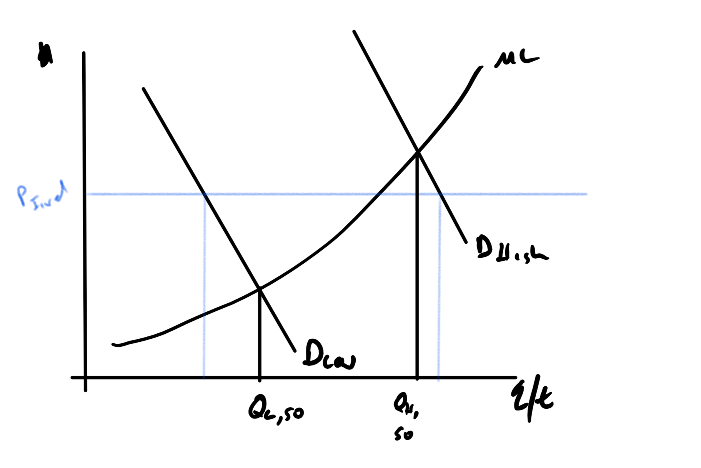
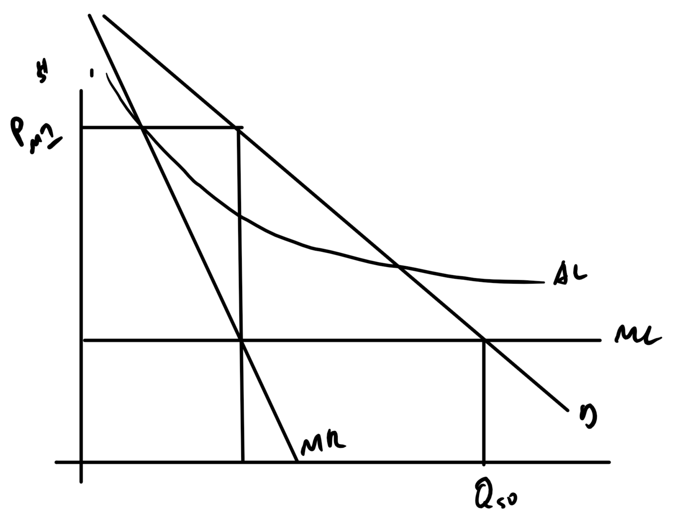
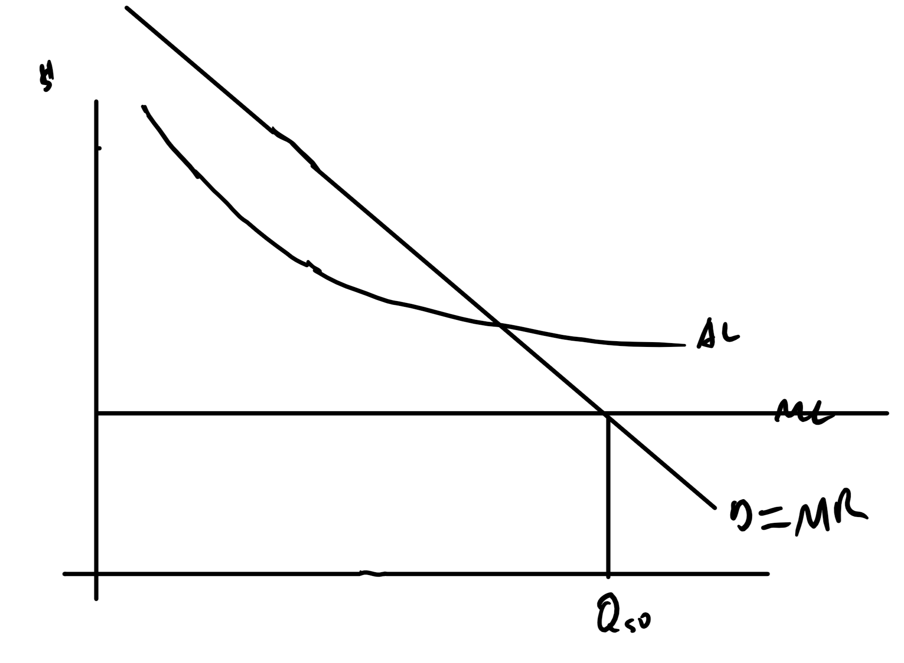
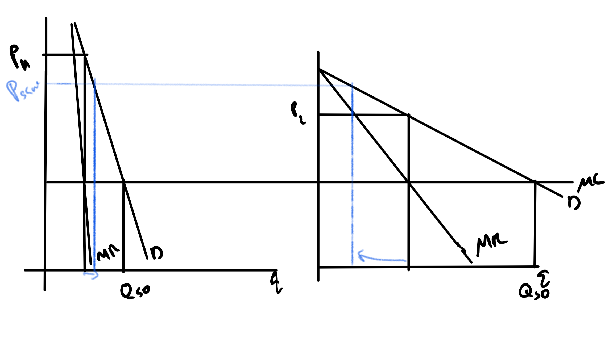
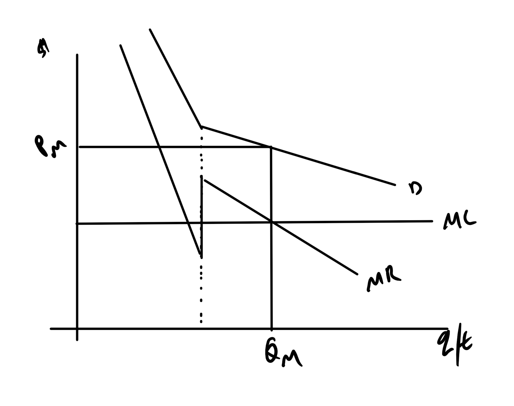
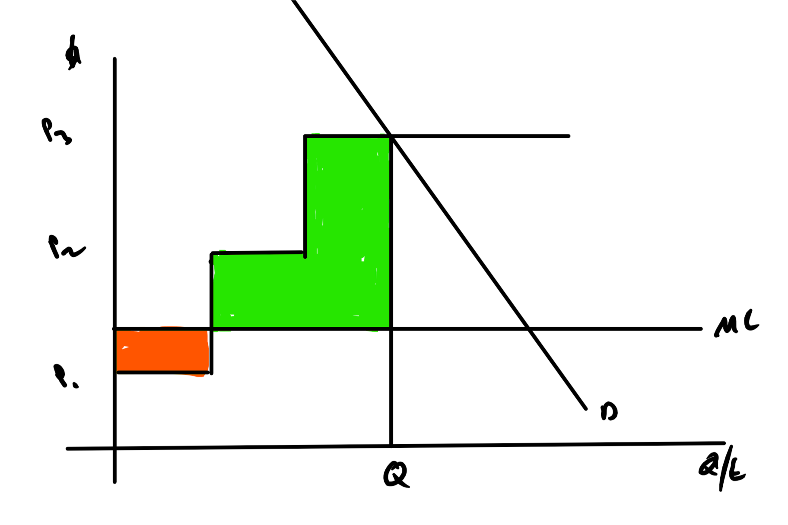
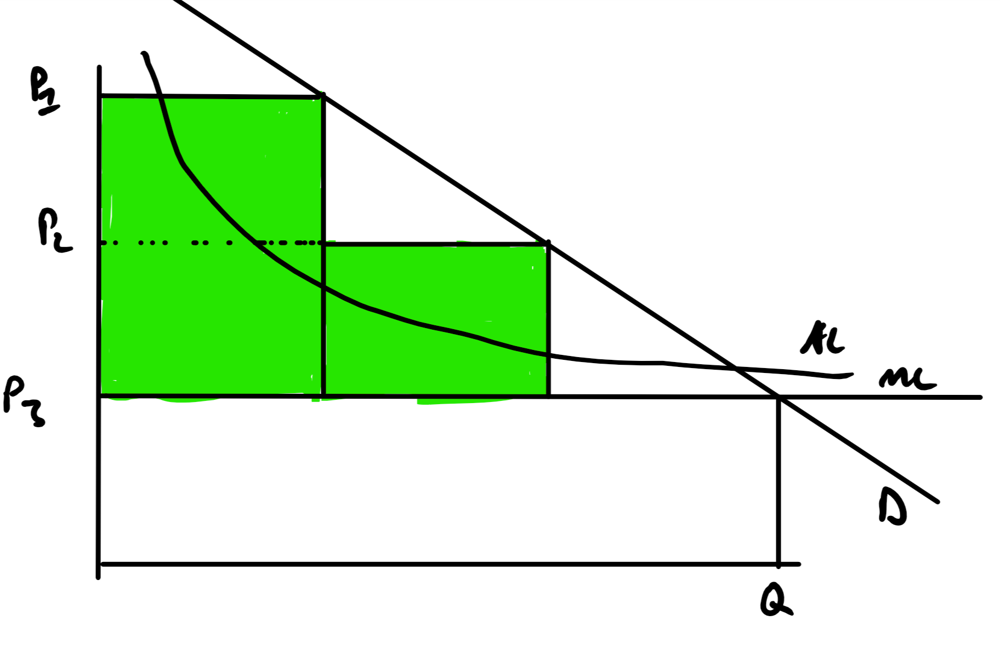

```{r setup, include=FALSE}
knitr::opts_chunk$set(echo = FALSE)
```


## Overview

+ The idea is to create a tariff a rate structure that,
    + Will satisfy the revenue requirements until the next rate case.
    + Balances efficiency, in the dead weight loss sense, with other objectives, e.g., equity.
    + Includes at least a nod to marginal cost pricing at some level.


## General Rate Patterns

+ Two-Part
+ Decreasing block tariff
+ Increasing block tariff
+ Peak/TOU pricing
+ Real-Time

The big question?  What do you mean by marginal cost.

## Variations for Other Purposes

+ Life-line or low-income
+ Electric heat or electric vehicle

## But First, Lets Talk about the Future

+ We need to make guesses about how much electricity people will use in the future.
+ Our projections  will be based on the past
    + Past overall consumption
    + Past installed  equipment and behavior
+ We need to make guesses about 20 year in the future.

## Data Overview

+ Appliance surveys for bottom up
+ System and rate class use time series for top down

Both are used to create models of future consumer behavior and forecast how the consumers will react to rates so that you can verify if the revenue requirement is satisfied.

## But First, Lets Talk Weather

How you model weather depends on the frequency of the load data you are working with.

+ Weather data is commonly from NOAA and it was a pain to get with FTP servers.
+ I used to have a cron job to get new California data every month and every day.
+ NOAA has better APIs these days.  For example to pull daily temperature data for PDX is 

> meteo_pull_monitors("USW00024229", date_min = "2016-01-01", date_max = "2016-12-31")

+ A Year of hourly data is 

> isd(usaf="726980", wban="24229", year =2016)


```{r, message=FALSE, warning=FALSE, include=FALSE}
library(rnoaa)


PortlandWeather <- meteo_pull_monitors("USW00024229",
                                      date_min = "2016-01-01",
                                     date_max = "2016-12-31") 
stations <- isd_stations()
PortlandHrly <- isd(usaf="726980", wban="24229", year =2016)

```

## In General

+ Try to get weather data that has similar frequency as your data.
    + If you are working with hourly load data, get hourly weather data.
    + If you are working with daily or larger aggregations of use, get daily weather and aggregate up.
+ Working with hourly data can be hard
    + Not all, and not a majority, of the NOAA data will have hourly observations.
    + Daily summaries are more common and you can get closer geographic matches.
    
+ Make trade-offs
    + You have fewer 1st order hourly stations (http://www.weather2000.com/1st_order_wbans.txt).
    + Often does not cover all the territory.
    + You sometimes have to make up your own data for isolated places using nearby 1st order stations.

## What NOAA gives you

Metric!!

Core Values (https://www1.ncdc.noaa.gov/pub/data/ghcn/daily/readme.txt)

+ prcp: Precipitation, in tenths of mm
+ tavg: Average temperature, in tenths of degrees Celsius
+ tmax: Maximum temperature, in tenths of degrees Celsius
+ tmin: Minimum temperature, in tenths of degrees Celsius
+ awnd: Average daily wind speed, in meters / second
+ wsfg: Peak gust wind speed, in meters / second

There are variables about gusts, clouds and other weather.  Except for dew point, which is used for relative humidity, I have stayed away from the others.

## Warning about hourly weather

+ These are mostly airports
+ Higher wind
+ Fewer trees
+ They tend to be cooler than the non-airport.  Keep in mind if you use a mix of hourly and daily measurements.

## Using Hourly Weather with Hourly Load

+ Not as easy as just putting in the temperature
+ Load for systems and individual households have an asymmetric response to temperatures.
+ The load tends to increase with temperature when temperatures are high.
+ Loads increase as temperature falls with low temperatures.
+ The cut between low and high temperature is different by region and household and often called the set-point or base temperature.
+ If you have a specification that allows for a an asymmetric, U-shaped or V-shaped response, you should be OK.

## Typical Shape

+ V shaped with an apex at around 68F (20C).
+ Slope of load reaction to high temperatures about x3 the reaction to low temperatures.
+ The low temperature load is either electric heat or air handlers.
+ Techniques
    + Run model multiple times with different set-point and choose the one with maximum fit.
    + Estimate the set-point within the model by making the transition U-shaped rather than V-shaped.
    + Discretize temperature into 5F blocks and estimate effect of each temperature.
    
## The techniques (Scan Over Setpoints)

+ Set up a load equation with 
$$L_i = \alpha + \beta_1 (b-T_i)I(b-T_i>0) + \beta_2(T_i -b)I(T_i -b>0) + g(X_i)$$
    
    + $b$ is the set-point
    + $T$ is the temperature
    + I is an indicator function
    + $g(X_i)$ are the other variables
    
+ Run regression over a range of b values and pick the one with the highest goodness of fit.

## What is Wrong With This? 

+ Everything !!!!
+ Treats the unknown $b-T$ data as known
+ Estimates $b$ outside the model even though it is used in the model and correlated with other parameters.
+ Don't get me started on multiple comparisons.

How to fix this, pick a base temp without looking and stick with it.  Easier and only has an errors-in-variables problem. 


## Smooth or Discretitze

+ Loess, a non-parametric technique would work for this problem.
+ Polynomial of degree 3 or higher, e.g., $\beta_1 T + \beta_2 T^2 + \beta_3 T^3$
+ Discretize temperature
    + Create a dummy variable for temperatures in the, [30,35), [35,40) range and so on.
    + Similar to polynomial and loess in flexibility.
    + Does not guarantee monotonic response without restrictions.


## How Many Models

+ It is possible for you to have one model, relation between weather and load, per hour per day of week, 24*7=168.
+ More than likely you can aggregate some hours, many night time hours can be aggregated.
+ Many days can be treated as the same:
    + Sometimes Weekday, Weekend
    + M-Th, F, Weekend.
    + M, F, T-Th, Weekend.
    + Some states have different Sunday shapes because of blue laws
+ The models will be part of a system
    + Often previous hour and previous day are useful.
    + Often errors within a day have correlated errors, SUR models

## Dealing with Daily and Lower Frequency Data

+ You often have to use daily data, because that is the best or only weather station.
+ You are modeling daily peak load.
+ Don't try averaging over longer periods.
+ You are in the land of degree days.

## What is a degree day?

+ Stole it from agriculture, growing degree day.
+ $HDD(b) = \max(0, b-Avg)$
+ $CDD(b) = \max(0, Avg-b)$
+ Average Temperature is the average of the daily high and daily low.
    + Not the average of the hours.
    + With shared base, there are either HDD in a day or CDD but not both.
    
## The Logic of HDD and CDD

+ Really tries to get at heating and cooling load.
+ Not comparable if the diurnal swing is very different, Hawaii vs Mojave.
+ Not knowing b has the same trouble as before.
+ Errors in CDD because of unknown $b$ cause correlated errors in HDD. (More Later)
+ I have tried way more complicated things and XDD measures work.

## Typical Models

+ $kWh = \alpha + \beta_1 CDD + \beta_2 HDD + g(X)$
+ CDD and HDD often, but not always have the same base.
+ There is a scanning methodology for the base and a within model technique


## Problems with CDD and HDD as commonly used

+ People make econometrics mistakes that make their models look better.
+ They treat XDD and the base temperature as a known instead of something that should be estimated.
+ Upshot:
    + Biased effect of HDD and CDD parameter, one up and one down.
    + Variance of estimators are smaller than they should be.
+ Use the spline based method, but watch for the point discontinuity.

http://www.sciencedirect.com.proxy.lib.pdx.edu/science/article/pii/S014098831400139X


## Main Points of the Paper

+ Stop guessing set-points and stop scanning for set-points
+ Either way, you are going to cause persistent under and over prediction for weather driven use.
+ Errors-in-variables 
    + Simple with one variable, just attenuation effect.
    + With two variables that are correlated, the attenuation pushes off each other biasing one value up and the other down.
    + It _tends_ to increase apparent precision of estimates.

## Heat Buildup and Other Effects

+ Loads at the beginning of a heat wave are typically lower than loads later even when the temperature is the same.
+ Happens when there is not enough time to let things cool off.
    + Think hot concrete
    + Attic spaces
+ You often put in a lagged CDD and HDD in your model $kWh = \alpha + \beta_1 CDD + \beta_2 HDD  + \beta_3 L(CDD) + g(X)$
+ or even polynomial lags $kWh = \alpha + \beta_1 CDD + \beta_2 HDD + \beta_3 \sum \gamma^n L^n HDD +  g(X)$ and estimate the weight of the lag, $\gamma$. 

## For the Metrics Crowd  

There is a lot of autocorrelation or a lot of misspecified models or a lot of people that want to avoid talking about autocorrelation.

+ Often misspecification looks like autocorrelation.
+ Once people learn that, they correct for autocorrelation they forget.

## Example of False Autocorrelation

```{r, echo=FALSE, message=FALSE, warning=FALSE}
FakeAuto <- data.frame(X = rnorm(200 , mean = 50, sd = 15))
FakeAuto$Y <- (FakeAuto$X-50)^2 + rnorm(200, sd = 100)

library(ggplot2)
library(dplyr)
FakeAuto %>% ggplot(aes(X,Y)) + geom_point()+ geom_smooth(method='lm')

```

## Why?

+ Simple specifications are easy to use
    + "How much does this go up by with a 2C increase in average temp?"
    + "What is the elasticity?" 
+ People know how to fix autocorrelation.
+ Often people don't fix autocorrelation because it hurts their argument.
    + Correcting for autocorrelation reduces the precision of estimates.
    + Turns p > .95 into p >.7 pretty quickly.
+ Non-technical people often have unreasonable standards or rules of thumb for econometric models.  
    + They treat low significance as the fault of the analyst.
    + All the tricks in the world can't fix a weak relationship and noisy data.

## Weather Normalization

There are two distinct weather normalization techniques in use.

+ First Meaning,  and _the_ correct use
    + Form a statistical model of load or energy use that depends on weather $y=f(Weather, X) + \epsilon$
    + Estimate the model, $\hat f(Weather, X)$
    + Use the average weather, commonly some kind of 30-year average to forecast what load or use would be for a typical weather year.
    + $\hat y = \hat f (\bar{Weather}, \bar X)$
    + This is a simple regression based forecast.

## Why do this?

+ If you hold equipment constant, energy use is a combination of weather and behavior.
+ You may have behavior that reduces use but it could be overwhelmed by weather, example Winter 16-17.
+ Allows you to hold weather constant


## The second, bad way

Use the normalized load and weather in a second model ...

+ Remember how "estimate" means different things to engineers and statisticians or economists?
+ They use normalized values as exogenous, i.e., RHS,  variables in other models.
    + These have lower variance, if original model was correct, than the actual variables.
    + Is kind of like 2SLS without the variance correction.
+ They use normalized values as endogenous, i.e., LHS, variables.
    + This is like trying to construct a model that is a good fit for the forecasts of a different model.
    + Artificially more precise estimates.

https://drive.google.com/file/d/0B2gPTwcA567qaF9pX0YwSkRqVlk/view?usp=sharing


## A Few Notes On Peak Esimation

There are a few common methodologies for estimating peak load.

+ *Peak Data* :Simple regression of monthly peaks on exogenous variables, i.e., just restrict the data.
+ *Simulate* :All data used in a load model but when forecasting bootstrap the error and find the distribution of the maximum load in year.
+ *Quantile regression*

## Peak Data

+ Most common technique
+ Last seen in an IRP
+ Most common problem is that it assumes that the error terms are symmetric.
    + Remember that the peak load is not just extreme values for exogenous variables
    + High values for the error term.
+ Probably should be estimated with a frontier but with negative skew --  not positive skew.
+ Better use a quantile regression model

## Simulate

+ Much less common
+ Model all loads.
+ Forecast future values
+ Bootstrap the errors from the original model and add to forecasts.
    + Means drawing, with replacement, a new set of error terms from the one you have.
    + Add these error terms, which have mean zero, to get a new forecast.
    + Find the maximum value in a year.
    + Repeat to get the sampling distribution for the maximum value in a year.
    
## Simulate (Cont)

+ This is how I did it until quantile regression became practical in about 2005.
+ BTW Bootstrapping is a great technique to learn.

"When the math gets too hard, bootstrap."

## Quantile Regression

+ Preferred tool but has not hit the PUC level yet.
+ Idea
    + OLS finds a line that has half the probability above and below the line.
    + Quantile allows you to choose how much probability mass is above and below the line.
+ You can literally say, given known weather, we expect the load to be below x, 90% of the time.
+ No assumption that the quantile lines are parallel

## Bottom Up Estimates

+ This usually uses survey data
    + RECS https://www.eia.gov/consumption/residential/
    + CBECS https://www.eia.gov/consumption/commercial/
    + MECS https://www.eia.gov/consumption/manufacturing/
+ State Do it Too
    + California RASS
    + Oregon does a few of these


## Pattern

+ Survey http://www.energy.ca.gov/2010publications/CEC-200-2010-004/CEC-200-2010-004-AP.PDF (Page 7)
+ Engineers take the data and form Unit Energy Consumption (UEC) estimates by specific end uses.
    + These UECs are usually annual kWh (3412 BTU) measures but you will also see them combined with Therms (100K BTU) for gas and BTU for total energy use.
    + Lots of assumptions need to be made for these estimates.
+ These estimates are then compared to statistical estimates of actual use, or
    + NAC (Normalized Annual Consumption), the adjustment I warned you about.
    + They create a statistically adjusted engineering model (SAE)
+ Everyone gets to use these numbers to estimate use given estimates of changes in the number of consumers.

## Problems? Plenty

+ Endogeneity
    + The choice of tenure (Own/Rent) and structure type is not independent of race and ethnicity but treated like it it.
    + Conference paper with a student https://github.com/woodsjam/EnergyEthnicity/blob/master/ConferencePaper/DraftEdwardsWoods.pdf
    + Housing market discrimination probably has something to do with use patterns.

+ Multicollinearity
    + Explanatory variables are correlated.
    + They share explanatory power
    + Messes up parameter estimates and variances are too high but forecasts are still good.

##  More Problems

+ Statistically Adjusted Engineering Models
    + Predict a real value with an engineering estimate and an intercept.
    + $Real = \alpha + \beta Estimate + \epsilon$
    + If the engineering estimate is good, $\alpha=0$ and $\beta=1$.
    + Didn't work for California http://www.energy.ca.gov/2010publications/CEC-200-2010-004/CEC-200-2010-004-V1.PDF (Page 129 or 143)
    + Better than previous RASS when they didn't notice that there was a problem.

## Once you know the future

+ You need to choose  prices that satisfy the revenue requirements for  several years.
+ General rate cases usually take place every 3-5 years
    + PUC or the Utility can call for one.
    + Utility, if they they profits are not high enough.
    + PUC, if they think profits are too high.
+ Once you start, it can be months or years till you are  done.
+ Note that there  is  always a  risk that things will not go as expected.

## The time between General Rate Cases

+ That and the time a case takes is generically called, "Regulatory Lag"
+ This is the topic  of the next chapter.
+ Lag is both a good thing and a bad thing.

Back to the tariffs ...

## Tariff Background

+ The ideal is to charge the marginal cost.
    + Efficient use
    + Minimizes dead weight loss
+ Marginal cost is different:
    + Every moment of every day of the year
    + Every customer
+ Tariffs, except for real-time tariffs, lump these moments together and treat them as if they are the same.
+ Tariffs need to be designed as close to marginal cost as possible while:
    + Being easy to understand and predict for consumer
    + Allowing for collection of the revenue requirement

## Why Fixed Rates Cause a Problem

+ With fixed rate
+ When low demand, there is under use and DWL
+ When high demand, there is over use and DWL

## Fixed Rate (Figure)



## Real-Time Tariff

+ Fixed cost per month
+ Marginal cost of electricity changes hourly
    + Usually by day-ahead wholesale market -- so you have warning.
    + Caps may be in place.
+ Most common in Industrial and Commercial but rare in Residential
    + You see them when there is greater capacity to react.
    + When the demands are more elastic
    + When they have generation capability
    + Where you have a meter that can handle it.
+ If you have an inelastic demand, the suppler has power

## RT Tariff in the real world

+ ComEd in Illinois has one https://hourlypricing.comed.com/
+ Attractive to risk tolerant, higher elasticity consumers
+ Residential consumers do peak shave, 2% or so is a normal estimation.
+ Don't time shift -- in the US.
    + Using timers is not part of US culture.
    + Not built into US equipment
+ It is like prices per kWh doesn't matter but price per month does.
+ Example of an automatic adjustment mechanism.

https://www-sciencedirect-com.proxy.lib.pdx.edu/science/article/pii/S092876551100042X


## Peak/TOU 

+ More predictable than RT
+ Still tries to collect attributable cost in each timer period
    + This is probably a mistake if you want shifting and not just peak reduction.
+ DWL is smaller.
+ Peaks are still shaved
+ Smart thermostats will pre-cool and heat. (https://nest.com/support/article/What-happens-during-a-Summer-or-Winter-Rush-Hour)

[*Socal Edison*](https://www.sce.com/wps/portal/home/residential/rates/Time-Of-Use-Residential-Rate-Plans/!ut/p/b1/hc9Bb4IwFAfwz7IDx9FXipR56yLWEpVhjcNeDBisJEANspF9-3XGi3Gb7_Z_-f2T95BCGVJt_lnpvK9Mm9c_WQW7WEwY5r4nErmkwLCMFjydk4j5FmwtgD-GwaP-O1IXgkPOZkKC4G8jH0RM10CpxOGU3oEV9SzYRPPkFXsQelfwwiGaxYkF65SAICksJWMEILiCf46MkdK1KS4Pb1lbkFAj1ZWHsis796Oz62Pfn85jBxwYhsHVxui6dPemceC3ytGce5TdSnRqMqjEsyq-hqdvTtaZJw!!/dl4/d5/L2dBISEvZ0FBIS9nQSEh/) has a good one 

## Block Tariffs

+ Block tariffs, different prices depending on use are the most common in the US.
+ DBT
    + As if the utility made a special capital expansion just for you.
    + Tries to mimic scale effects, lower AC as quantity increases.
    + As if all loads were correlated with each other
+ IBT
    + As if you are responsible for additional capital expansions because of your load.
    + Tries to encourage conservation
    + Often intended to help the poor.

Please keep in mind that this is all price discrimination, either second or third degree.

## Price Discrimination Terminology

+ 1st degree: Personal prices
+ 2nd degree: Different products (Menu pricing)
+ 3rd degree: Different groups (Student discounts)

## Price Discrimination

+ Usually you think of this as bad.
+ When there is a monopolist, price discrimination:
    + Increases monopoly profits
    + Increases sales
    + *Decreases* dead weight loss

## Monopolist with One Price



## First Degree (Personal Prices)



## 3rd Degree Price Discriminate


## More Formally

+ Add the demands together, horizontally, to get market demand
+ There is a kink
+ This causes a discontinuity in MR.

## More Formally



## And you wonder why People hate economists

Discrimination Means:

+ ...in the real world, charging different prices depending something *other than ability* to pay or sensitivity to prices.
+ ... to an economists different prices because a *different ability* to pay.


We have low income CARE rates and rates for  electric heat, not separate prices for male and female headed households.

## IBT

+ High CS for low use.
+ Fixed cost collected at higher use.
+ Intended to help the poor?
    + What if there is an what if larger families have lower income?
    + https://censusreporter.org/data/table/?table=B19019&geo_ids=04000US41&primary_geo_id=04000US41
    
## IBT Diagram



## IBT Example

Here is one from PG&E

https://www.pge.com/tariffs/assets/pdf/tariffbook/ELEC_SCHEDS_E-1.pdf
    

## DBT

+ CS is more even over use
+ Fixed cost collected at lower use

## DBT Diagram



## DBT Example?

You don't really see these for electricity any more.

You do see them in competitive markets as a volume discount.

https://www.verizonwireless.com/plans/data-only-plan/

## Life-line or Low-Income Tarrifs

+ The "on average" fix of IBT is only partially right.
+ We tend to avoid direct income support in the US
+ Lower prices for the poor is an acceptable second-best solution.
    + We do it all the time.
    + Rents, fuel, education, ..., even the Romans did it.
+ May not increase total CS but
    + CS assumes a that each person is the same.
    + All gains to one person is the same as equal gains for all.
    + Lower price for poor, weights them more highly.
+ Wait, why lower prices for students and the elderly?
    + More elastic demand because more flexibility.
    
## Examples

+ California Low-income (CARE) [_tariff_](https://www.pacificpower.net/content/dam/pacific_power/doc/About_Us/Rates_Regulation/California/Approved_Tariffs/Rate_Schedules/Residential_Service_California_Alternative_Rates_for_Energy_CARE_Optional_for_Qualifying_Customers.pdf)
+ Regular [_Tariff_](https://www.pacificpower.net/content/dam/pacific_power/doc/About_Us/Rates_Regulation/California/Approved_Tariffs/Rate_Schedules/Residential_Service.pdf) 
Often

## In Short

+ The form of the tariffs are usually aimed to get to marginal cost pricing
    + The conception of marginal cost differs, personal power plant of DBR, personal responsibility in IBR.
    + Time scale of marginal cost (Costing period), minute-by-minute of RT, average within a day with TOU, etc.
+ Some 3rd degree discrimination
    + Industrial, agricultural pumping, etc.
    + Low income CARE rates
    + Electric heating rates.


## Summary So Far

+ We have established the revenue requirements for each rate class.
+ Briefly looked at ways of estimating how much energy will be required in the future.
    + Top down load forecasting methodology, including regression based and  quantile regression.
    + Survey based, bottom up, methods
+ The basic "shapes" of tariffs.

We need to transition how tariffs are set.

## Where to Start

+ Start with incremental costs of how to add capacity or generation to serve the future load.
    + Use the test year.
    + Assume that you satisfy the increase  with cheap fixed cost, high fuel cost peakers.
    + A system simulation, like AURORA, focusing on loss of load expectation (LOLE) target.
+ Rig prices so that the incremental costs are distributed.
+ True up the prices to meet the revenue requirement.

## AC vs MC Battle

+ Much of the difference is between average costs and marginal costs.
+ More accurately, between marginal costs and average costs masquerading as marginal costs.


## Peaker Method

Blend of old vertically integrated cost of service and new ISO style regulation.

+ Given that peaker plants are often paid to provide stand-by service
    + Ancillary, less than an hour, service markets
    + Payment is often for MW of capacity withheld and usable
    + Additional payments for MWh generated.
+ What would a merchant generator build?
+ That is how you estimate those costs.

The actual methodology is _far_ more complicated.

## Aurora and other simulations

+ Basically a model of your transmission, generation and distribution system.
+ Adding in:
    + Weather
    + Prices and costs to run generation, i.e., what to dispatch.
+ Run these out into the future:
    + Find the least cost way of hitting your LOLE (Loss of Load Expectation)
    + You run a lot of these.

## Report from AURORA user

+ Takes 2 hrs for 20 year simulation
+ Ran 500 last month, 4 days on 5 computers.
+ Mapping expected costs on a latin hypercube design.


## Key Difference Between Electricity and Natural Gas

+ With electricity, power takes all paths, some more than others.
    + Paths with low resistance and reactance (Remember the reactive power) will take more.
    + Equal sized wire generally means equal power.
    + Hard to allocate who benefits from adding transmission.
+ With Natural gas
    + Valves!
    + You can more easily split out incremental cost.

## On Average (Cost) Raises Its Head

The book has a nice worked example of Rolled-In (average)  vs Incremental Rates (marginal) on p. 251-255.  BTW 100 MMBtu = 1,000 therms, not 100.

+ Path from A to B: \$100 cost, 100MMBtu, Rate = $\frac{\$100}{100MMBtu}$ \$1/MMBtu
+ Now add a new customer that also wants to transport 100MMBtu from A to D.
    + Share part of the path from A to B at intermediate point C.
    + A to C carries 200MMBtu, 100MMBtu for person at B and 100MMBtu for person at D.
    + C to B carries the original 100MMBtu
    + C to D, the new pipe, carries the new 100MMBtu

Total cost of the pipeline goes from \$100 to \$250

## How Average Cost would work

This is a we are all friends (Rolled-in) Rates.

+ $\frac{\$250}{200MMBtu} = \$1.25/MMBtu$ 
+ The customers going from A to B were paying a $1/MMBtu before.
+ Original customers subsidize the new ones.

## Now break it up into pieces

+ A to C carries 200MMBtu on \$50 worth of pipeline, $\frac{\$50}{200MMBtu} = \$0.25/MMBtu$ 
+ At C
    + 100 MMBtu goes on from C to B on $50 worth of pipeline, $\frac{\$50}{100MMBtu} = \$0.50/MMBtu$ 
    + 100 MMBtu goes on from C to D on the new $150 pipeline, $\frac{\$150}{100MMBtu} = \$1.50/MMBtu$
+ In summary
    + A to B, \$0.25/MMBtu + \$0.50/MMBtu = \$0.75/MMBtu
    + A to D, \$0.25/MMBtu + \$1.50/MMBtu = \$1.75/MMBtu

The new customers help defray the cost of the pipeline from A to C by doubling the use.

## The Death Spiral, Rolled-in Rates and Cream Skimming.

+ Cream Skimming means pulling some low cost to serve customers out of the system.
+ In this case picture the two rolled-in rate prices, \$1.25/MMBtu and \$1.00/MMBtu.
+ You could convince some of the original A to B customers to leave
    + Build a new A to B pipeline for $100
    + Offer to transport for \$1.20/MMBtu
    + Works as long as $100/$1.2 = 83.33 MMBtu defect.  Call it 85 MMBtu
+ After the defection of 85 MMBtu the original ABCD system carries 115 MMBtu for a cost of $250.
+ The original system has to charge $250/115 MMBtu = \$2.17/MMBtu

That would induce others to leave.


## Cream Skimming

Attracting the low cost to serve customers under a rolled-in price regime and serving only those customers.  This leaves the high cost customers for the incumbent.

+ Charter schools
+ Health insurance
+ Life insurance

When you have rolled-in prices, there is a chance this will happen.

## Methods to True up 

+ It is rare for a marginal cost study to yield exactly the revenue requirement.
+ Most often it is adjusted up.
    + Proportional prices (Opposite of Ramsey)
    + Ramsey

## Up next

+ Chapter 8, adjustment mechanisms.