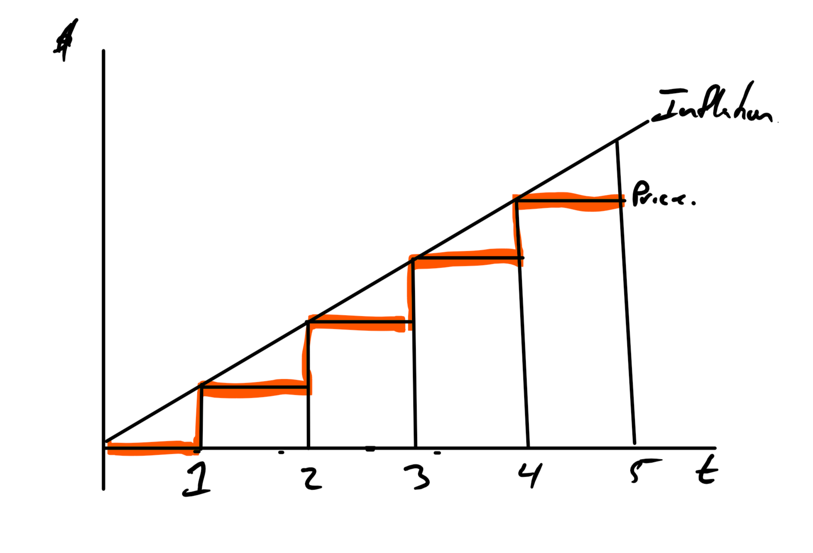
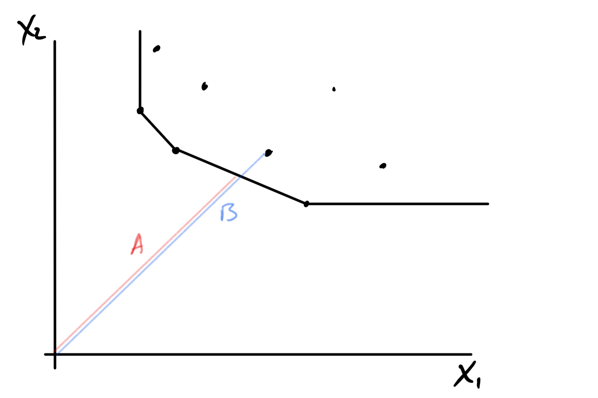
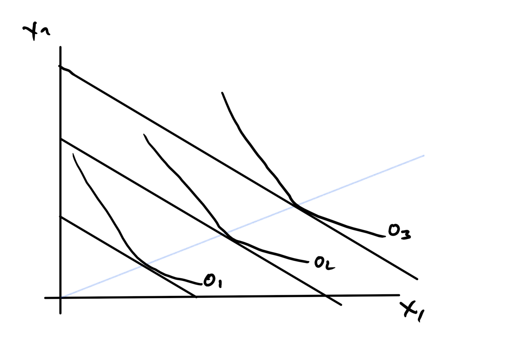
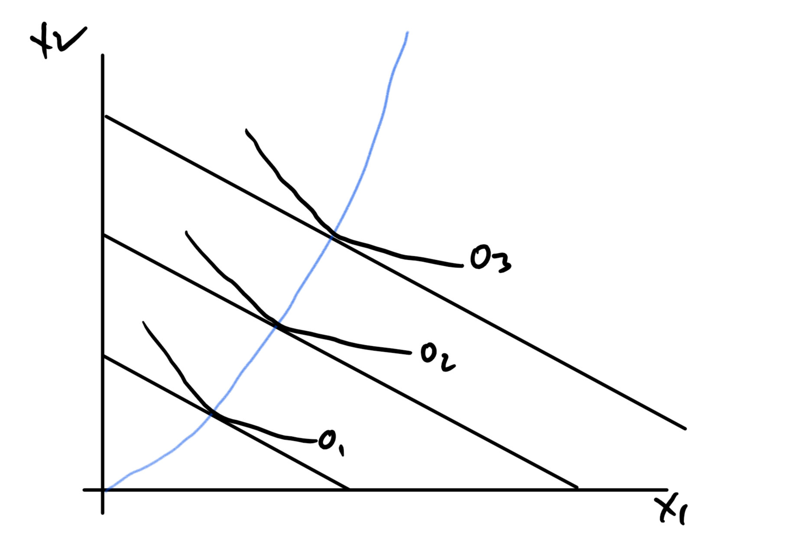
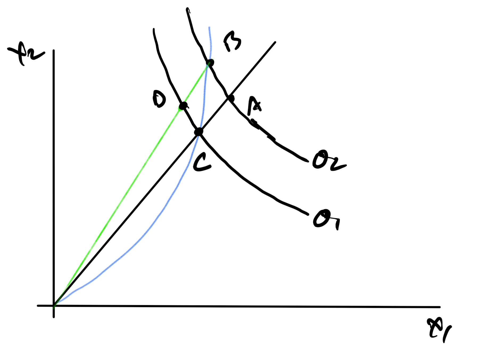

```{r setup, include=FALSE}
knitr::opts_chunk$set(echo = FALSE)
```

## Some Problems with Rate Setting

+ Rate of return regulation is periodic
    + Either the utility or the PUC can start a new rate case
    + PUC if profits seem high
    + Utility if profits seem low
+ Usually 3-5 years between -- called "regulatory lag".
+ This may limit incentives to make cost reducing investments.
+ May cause wide swings in regulated prices (Fuel prices changing)

## Evaluating Lag Requires Us to Deal with Time

+ This is time consistent time value of money
+ Standard topic in some intro economics courses
+ Engineers will have seen it in their engineering economics courses, EC314 at PSU.

## Assumptions

These are demonstrably false but give us tractable methods.

+ Costs and benefits of equal size have equal value in all time periods. _Can evaluate without worrying about wealth or taste changes._
+ The value of costs and benefits is independent of costs and benefits  in other time periods. _No habit, addiction or hangovers._
+ Benefits offset costs. _Ever fought a parking ticket?_
+ Future values are known with certainty. _Math is easy_

## What it looks like

$$\sum x_n d(n)$$

+ $d(n)$ is a discounting function.  
+ Many are possible but only a few are time consistent.
    + $d(n) = \frac{1}{(1+r)^n}$ for discrete time.
    + $d(n) = \frac{1}{e^{r n}}$ for continuous time.

## Example of Time Inconsistency

Back in the day I did this in class with real beer.  Now, it's a policy violation.

+ Chose 6-pack of beer a month and a day from now or 1 beer a month from now.
+ A beer right now or a 6-pack tomorrow.
+ Many of you changed your mind.

## Integer time

+ Will say "Time 1", "Time zero" because "1st time period is confusing"
+ "Now" means time zero.
+ Intervals are half open on the right, e.g., $[0,1)$
+ Jan 1, 1908 and Dec 31, 1908 are in the same period, but Jan 1, 1909 is not, when the unit of analysis is a year.

## Time Consistent  Integer Time Discounting

$$F= P (1+i)^N$$

Symbolic notation depends on context.

+ i = The interest rate
+ P = Present worth *or* some value in time zero.
+ N = N time periods from Now *or* Time N
+ F = Future Value *or* Present Value in time N *or* A value in time N.

## Easy Future Value Calculation

"If you deposit  $26 into an account that earns 2% a month, how much will be in the account after 500 months?"

$$F = 26(1+.02)^{500} = `r 26*(1+.02)^500`$$

## Easy Present Worth Calculation

"How much would you have to deposit now into an account that earns 10% per year to have 100K in 10 years?"

$$P = \frac{100K}{(1+.1)^{10}} = `r 100/1.1^10`K$$

## Incentives to Innovate

+ Utilities have to impose a cost on themselves to innovate in time zero
+ The cost to innovate is $I_0$
+ The innovation reduces constant marginal costs in future periods of $\Delta_c$
+ The utility enjoys the cost savings until time $t$
+ The regulators then reduce price by $\Delta_c$
+ The firm faces a discount rate of $\delta$

## Regulator never changes prices

A regulated firm will expend effort $I_0$ in time zero for change in cost $\Delta_c$ in future periods when:

$$I_0 \leq \sum_{n = 1}^\infty \frac{\Delta_c}{(1+\delta)^n} = \frac{\Delta_c}{\delta}$$

Basically, as long as the sum of discounted benefits in the future is at least as big as the cost.

## Now The Regulator Revises Prices Every Three Years

This means that all benefits of the investment, $I_0$, vanish after three years

$$\begin{aligned} I_0 \leq  \frac{\Delta_c}{(1+\delta)^1} +\frac{\Delta_c}{(1+\delta)^2} + \frac{\Delta_c}{(1+\delta)^3} \leq \frac{\Delta_c}{\delta} \end{aligned}$$
Note that savings in each year, $\Delta_c$, must be larger than before to warrant expense, or  $I_0$ must be smaller.

## Longer Period Between Adjustments

The more investments you will see.
$$\begin{aligned} I_0 \leq  \frac{\Delta_c}{(1+\delta)^1} +\frac{\Delta_c}{(1+\delta)^2} + \frac{\Delta_c}{(1+\delta)^3} \leq\\
\frac{\Delta_c}{(1+\delta)^1} +\frac{\Delta_c}{(1+\delta)^2} + \frac{\Delta_c}{(1+\delta)^3} \frac{\Delta_c}{(1+\delta)^4}\leq \\
\frac{\Delta_c}{\delta} \end{aligned}$$

So, encourage innovation, more regulatory lag is good.

## In Summary

+ Because all cost savings are reflected in lower prices at the next rate case, there are some cost saving investments that are not made.
+ More lag, encourages more cost saving investments.

## Lag Can Also Be Bad

If there is general inflation, then lag can cause the utility to not capture the cost of service in price.

+ Costs increase constantly
+ Prices are only set periodically to match those current costs


## Bad Lag



## Yes, there are fixes to this

+ Set prices not to current costs, but expected average over until the next rate case taking into account the cost of funds.
+ Have automatic adjustments based on actual inflation.
+ Have costs that have a market basis pass through to consumer. More common with Natural Gas (https://www.nwnatural.com/uploadedFiles/25150-1.pdf)

## Adjustment for Anticipated Inflation

+ P: Rate (Price) at start of new rate period, time one (Note time convention difference.)
+ $\pi$: Expected inflation
+ r: Regulated rate of return
+ T: Years between rate adjustment
+ $P^*$: Fixed Inflation adjusted rate

$$\sum_{t=1}^{T} \frac{P (1 + \pi)^{t-1}}{(1+r)^{t-1}} = P^* \sum_{t=1}^{T} \frac{1}{(1+r)^{t-1}}$$ 

## Result is a porportional increase
$$\begin{aligned}\sum_{t=1}^{T} \frac{P (1 + \pi)^{t-1}}{(1+r)^{t-1}} = P^* \sum_{t=1}^{T} \frac{1}{(1+r)^{t-1}}\\ 
\frac{P^*}{P} = \frac{\sum_{t=1}^{T} \frac{(1 + \pi)^{t-1}}{(1+r)^{t-1}}}{\sum_{t=1}^{T} \frac{1}{(1+r)^{t-1}}}
\end{aligned}$$ 

+ Book goes on to continuous time discounting but ...
+ Note quite the average of starting and ending, closer to start than end.

## The General Method of Automatic Adjustment

+ Many names, I knew this as "CPI-X".
+ Book calls it "RPI-X"
+ Says prices increase by some measure of the rate of inflation less some percentage amount X determined by:
    + K: Capital investments
    + Q: (Q)uality of service
    + Z: Input price changes and other factors
+ The factors are often summarized through
    + Regression to give Total Factor Productivity (TFP), or
    + Data Envelopment Analysis (DEA)

This is rare in the US but most common in UK
    
## How Automatic Adjustment Helps

+ It unlinks _specific_ investments in cost savings from the price.
+ Assumes a general rate of investment in cost savings.
+ If the utility invests more than assumed, more profits
+ If the utility invests less than assumed, less profits

Yes, you do fight over the assumed rate.  Yes, you do reset the rates based on cost but there is a longer lag period.

## How  to interpret the X

+ There is an economy wide increase in productivity that increases output
+ There is also monetary inflation.
+ The price level goes up by monetary inflation less productivity

The X is the amount by which the industry exceeds the average increase  in productivity.

## Creating an X

+ This is mostly through finding a good estimate of future total factor productivity (TFP)
+ Many cautions here:
    + Lots of things go by the name TFP.
    + An economist would not recognize all of them as TFP
    
## Economist Point of View

+ You are estimating a regression equation.
+ Some measure of output
+ Some measures of inputs
+ You may make some ad hoc adjustments.

You can do this from FERC Form 1 for the most part
[*Example PGE Form 1*](http://investors.portlandgeneral.com/static-files/3bd63503-9363-4671-b7db-e585353b22de)

## Make a Regression

+ Include an output measure, for example total kWh.
+ Include measures of input, labor hours, the capital stock of the plant and other factors.
+ Include one last variable, the constant term.  That will be your TFP measure.
+ The rules differ by jurisdiction, UK, AU, NZ, etc.

For example:
$$KWh = AK^{\alpha}L^{\beta}$$
or
$$KWh = ln(A) + \alpha ln(K) + \beta ln(L)$$
Your regression will estimate A, $\alpha$, and $\beta$. ln(A) is the growth in TFP.

## Data Envelopment Analysis

+ We had a brief introduction to Data Envelopment Analysis (DEA) earlier in the class.
+ Our context was input-output space, i.e., index of inputs on the horizontal and index of outputs on vertical axis.
+ DEA can also work in input space with isoquants

## Example DEA in Input-Isoquant Space



## Comment

+ Technical Efficiency is $A/B$,i.e., best divided by you. [0,1].
+ Assumption of homothetic production functions, optimal proportion of inputs is constant over a wide range  of output levels.
    + Homothetic means, $f(ax) = a^n f(x)$
    + n = 1 is constant returns to scale
    + n < 1 is decreasing returns to scale
    + N > 1 is increasing returns to scale
+ Not a DEA expert but
    + How do you assess goodness of fit?
    + How do you evaluate input parameter choices?
    + What is random, the population or the sample?
    + Yes, you can bootstrap, but parameter estimates from data should come with:
        + Distribution of belief, or
        + Distribution of uncertainty.

## Homothetic Production




## Properties of homothetic production

+ The ratio of inputs is constant over all scales
+ If you know the optimum at one level, you can just multiply

## Non-homothetic

+ The most common kind are quasi-linear, $f(x,y) = a + g(y)$
+ Proportions of inputs change with output levels.

## Non-homothetic



## How Efficiency Index Can Break




## How it Breaks

+ Suppose you are at A with output slightly higher than baseline level
    + Technical Efficiency is OB/OA
    + But you should be at B
+ Even if you were at B, you would still be technically inefficient
+ Captures only the scale difference
+ Does not get that the ratio of $X_1/X_2$ is wrong at those input price levels.
+ That is the consequence of the homotheticity assumption.


